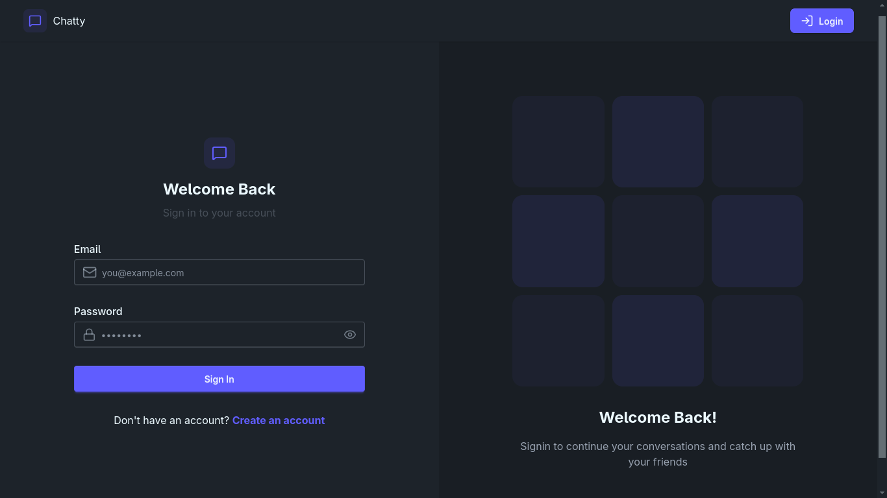
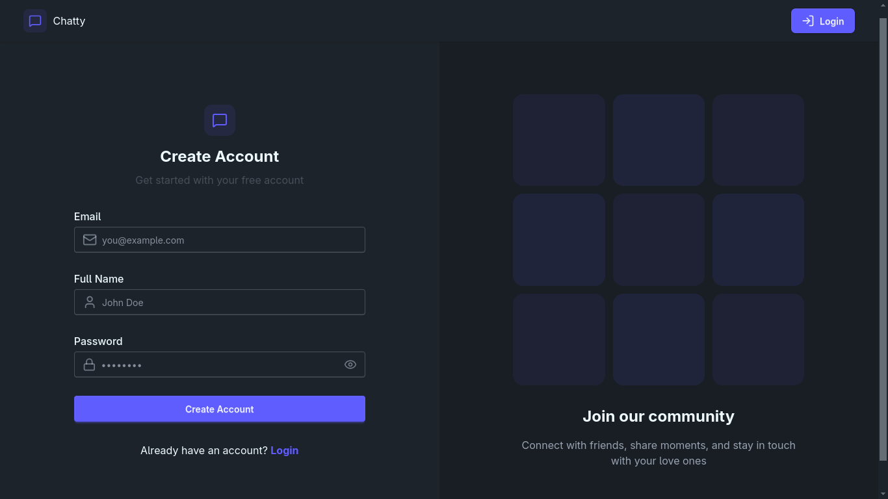
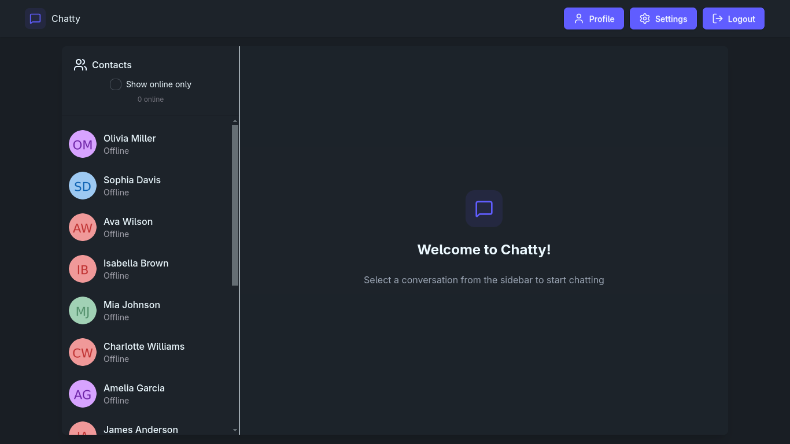
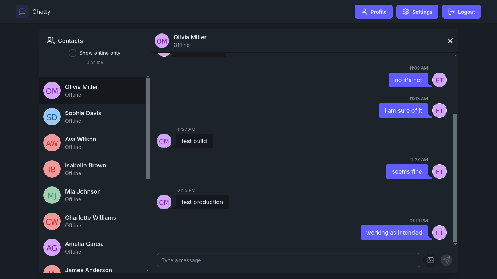
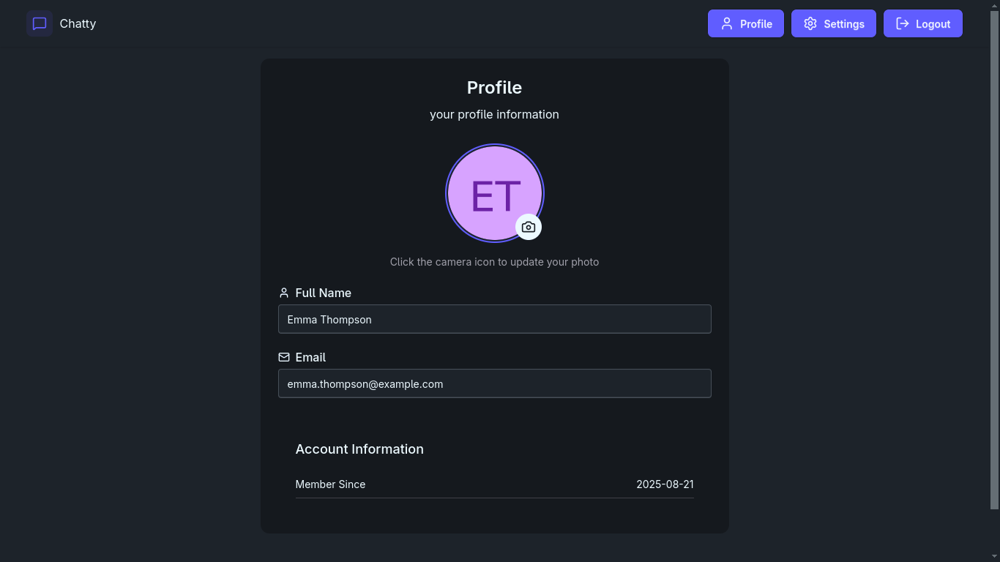
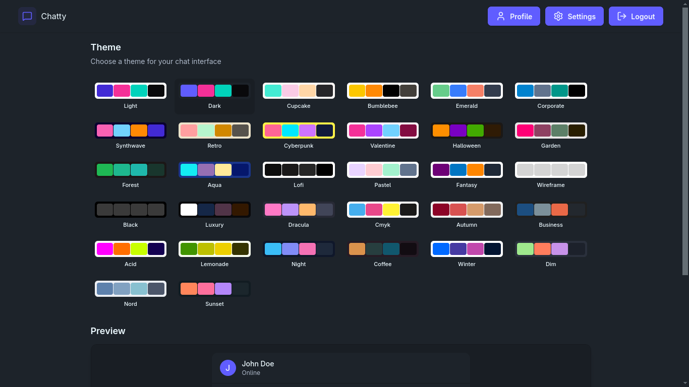

# Chat App

Welcome to the **Chat App**! This is a real-time chat application built with modern web technologies. It allows users to communicate seamlessly with features like real-time messaging, user authentication, and profile management.

## Features

- **Real-Time Messaging**: Send and receive messages instantly using WebSockets.
- **User Authentication**: Secure login, signup, and logout functionality.
- **Profile Management**: Update your profile details, including your profile picture.
- **Online Status**: See which users are currently online.
- **Media Sharing**: Share images in your messages.
- **Responsive Design**: Optimized for both desktop and mobile devices.

## Tech Stack

### Frontend

- **React**: For building the user interface.
- **Zustand**: For state management.
- **Tailwind CSS**: For styling.
- **Vite**: For fast development and build tooling.

### Backend

- **Node.js**: For the server-side runtime.
- **Express.js**: For building the REST API.
- **Socket.IO**: For real-time communication.
- **MongoDB**: For the database.
- **Cloudinary**: For image storage and management.

## Installation

### Prerequisites

- Node.js (v16 or higher)
- MongoDB
- PNPM (or NPM/Yarn)

### Steps

1. Clone the repository:

   ```bash
   git clone https://github.com/eslam-dv/chat-app.git
   cd chat-app
   ```

2. Build & Install dependencies:

   ```bash
   pnpm build
   ```

3. Set up environment variables:

   - Create a `.env` file in the `server` directory.
   - Add the following variables:

   ```env
   MONGO_URI=your_mongodb_connection_string
   JWT_SECRET=your_jwt_secret
   CLOUDINARY_CLOUD_NAME=your_cloudinary_cloud_name
   CLOUDINARY_API_KEY=your_cloudinary_api_key
   CLOUDINARY_API_SECRET=your_cloudinary_api_secret
   ```

4. Start the server:

   ```bash
   pnpm start
   ```

5. Open the app in your browser:
   - `http://localhost:5001`

## Usage

1. **Sign Up**: Create a new account.
2. **Log In**: Access your account.
3. **Start Chatting**: Select a user from the sidebar and start sending messages.
4. **Update Profile**: Go to the profile page to update your details.

## Screenshots

#### Login & Signup Page




#### Chat Interface




#### Profile Page



#### Settings Page



## License

This project is licensed under the [MIT License](LICENSE).
